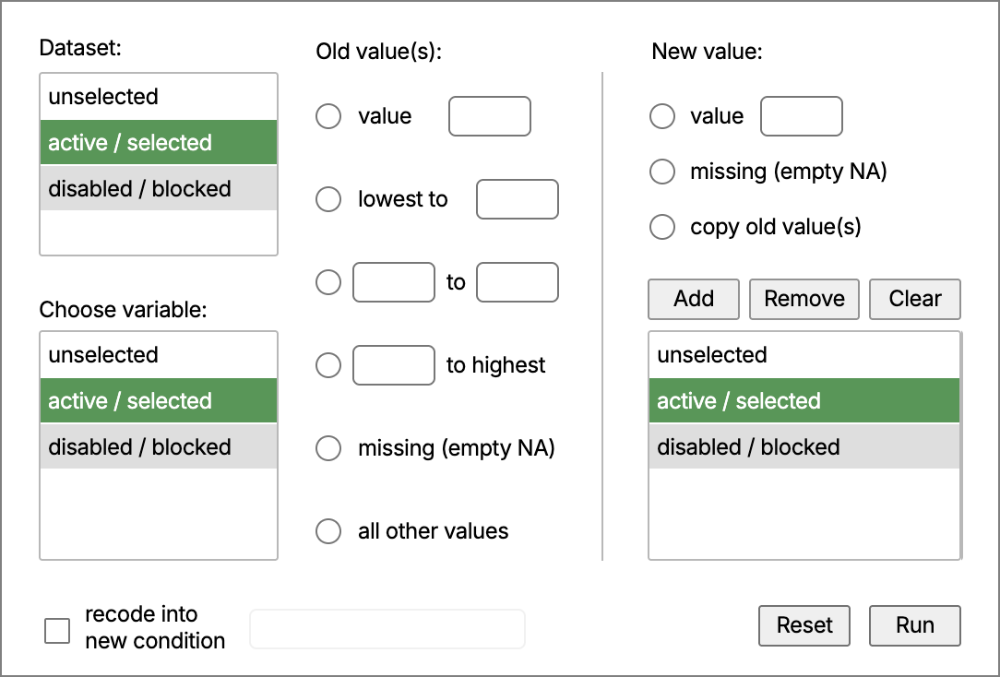
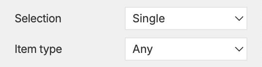
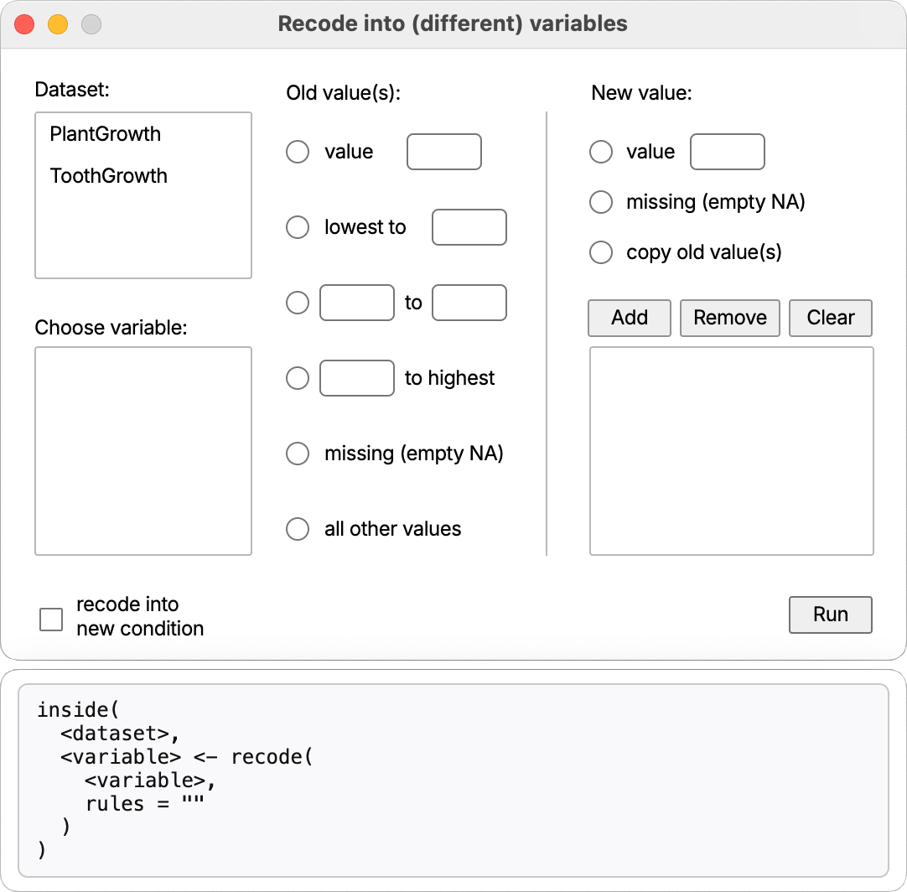
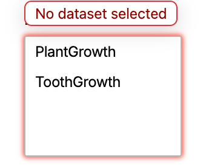
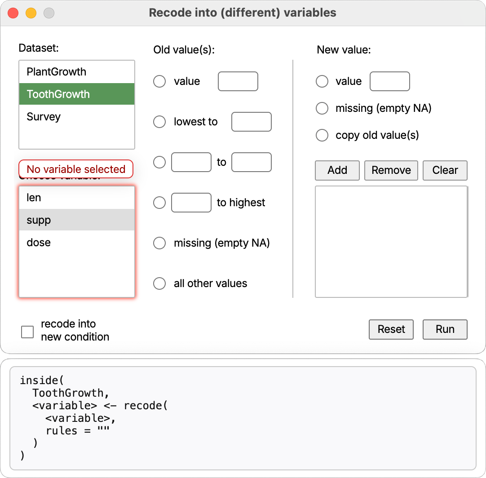
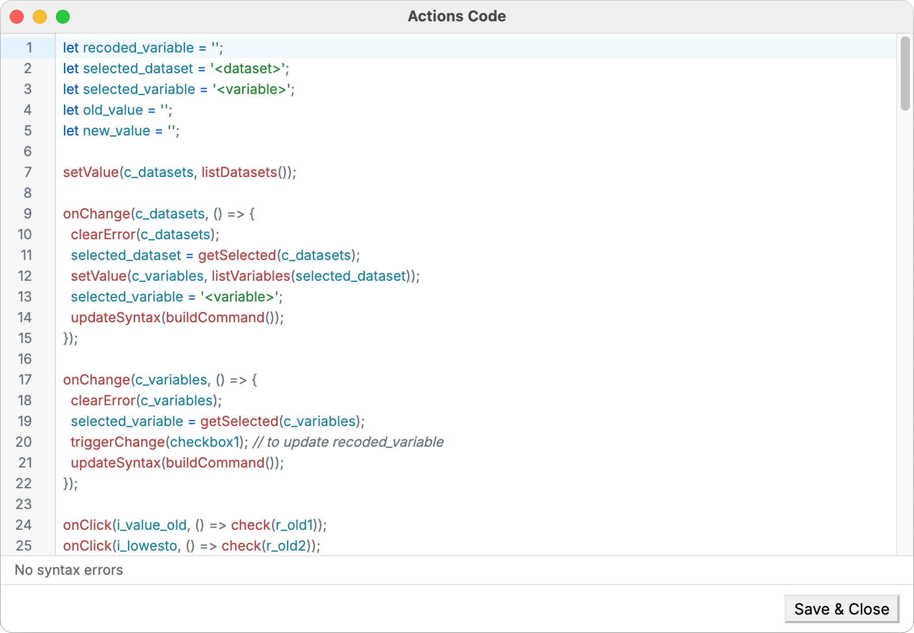

# Dialog Creator — API Reference

Use this reference when writing custom JavaScript for Dialog Creator. It contains information about window helpers, event utilities, and data APIs available in the preview runtime.


## Scripting API — reference

`showMessage(message, detail?, type?)`

- Shows an application message dialog via the host app.
- message is the visible header; detail is the body text; type (optional) controls icon: 'info' | 'warning' | 'error' | 'question'.
- The message and detail strings are translated automatically when the active dialog locale has matching entries.
- Examples:
- `showMessage('Hello')`
- `showMessage('Low disk space', 'Please free up 1GB', 'warning')`
- `showMessage('Save failed', 'The dialog failed to save your changes.', 'error')`

`getValue(element)`

- Get the element's value/text.
- Input/Label/Select/Counter return their current value; Checkbox/Radio return their current boolean state.
- Choice returns an array of objects shaped like `{ text, state }`, in the current visible order. `state` is one of `off`, `asc`, or `desc`.
- Returns `null` if the element doesn't exist.

`setValue(element, value)`

- Set the value/text.
- Input/Label: set string; Counter: set number within its min/max; Select: set selected option by value; Checkbox/Radio: set boolean state.
- For Container, pass an array of strings or objects shaped like `{ name, numeric, active }`, where type flags are boolean fields.
- For Container with **Pin on top** enabled, selected rows are re-rendered above unselected rows in Preview after the value update. If **Item Order** is also enabled, pinned rows follow the stored selection order.
- For Choice, pass either an array of strings like `['var1:asc', 'var2:desc']`, plain strings like `['var1', 'var2']`, or objects shaped like `{ text, state }`.
- For Choice with Ordering set to `no`, any active state is normalized to a simple selected state. For Ordering set to `increasing` or `decreasing`, both `asc` and `desc` are preserved.
- No-op if the element doesn't exist. Does not dispatch events automatically.

`isChecked(element)`

- For Checkbox/Radio, returns the live checked/selected state as a boolean.

`check(...elements)` / `uncheck(...elements)`

- Convenience methods for Checkbox and Radio elements to set on/off.
- For Radio, `check(element)` also unselects other radios in the same group.
- Passing multiple radios from the same group in a single `check(...)` call throws an error.
- These do not dispatch events by themselves; for the handlers to run, use `triggerChange()` or `triggerClick()`.

`getSelected(element)`

- Read the current selection(s) as an array of values.
- For Select, returns a single-item array (or empty array if nothing selected).
- For Container, returns labels of all selected rows. If Item Order is enabled, the array is returned in the click order.
- For Container with Pin on top enabled, this changes only the visible row order in Preview; the returned values still follow the selection-order rule above.
- For Choice, returns the active items. With Ordering set to `increasing` or `decreasing`, each selected value includes the direction suffix, for example `['var1:asc', 'var2:desc']`. With Ordering set to `no`, it returns only the selected labels.

`isVisible(element)`: boolean

  - Returns whether the element is currently visible (display not set to 'none').

`isHidden(element)`: boolean

  - Logical complement of `isVisible(element)`.

`isEnabled(element)`: boolean

  - Returns whether the element is currently enabled (not marked as disabled).

`isDisabled(element)`: boolean

  - Logical complement of `isEnabled(element)`.

`show(element, on = true)`

  - Show or hide by boolean. Use `show(element, true)` to show; `show(element, false)` to hide.

`hide(element, on = true)`

  - Convenience inverse of show: `hide(element)` hides, `hide(element, false)` shows. Internally calls `show(element, !on)`.

`enable(element, on = true)`

  - Enable or disable by boolean. Use `enable(element, true)` to enable; `enable(element, false)` to disable.

`disable(element, on = true)`

  - Convenience inverse of enable: `disable(element)` disables, `disable(element, false)` enables. Internally calls `enable(element, !on)`.

`onClick(element, handler)`

  - Shortcut for `on(element, 'click', handler)`.

`onChange(element, handler)`

  - Shortcut for `on(element, 'change', handler)`.

`onInput(element, handler)`

  - Shortcut for `on(element, 'input', handler)`.

`searchIn(input, ...containers)`

  - Makes an Input behave like a live search box for one or more Container elements.
  - Filtering is case-insensitive and matches item names by partial text.
  - Matching rows stay visible; non-matching rows are hidden.
  - Search filtering does not clear the current selection automatically.
  - The current search remains active if the target container is later repopulated with `setValue()`.
  - Throws a SyntaxError if the first argument is not an Input, if a target does not exist, or if a target is not a Container.

`enableSearch(...containers)`

  - Enables transient `Cmd/Ctrl+F` search for the specified Container elements in Preview.
  - The hovered enabled container becomes the search target when the shortcut is pressed.
  - Only one transient search box can be open at a time.
  - `Esc` closes the current transient search and clears its filter.
  - If the transient search input loses focus while empty, it closes automatically.
  - Throws a SyntaxError if no targets are provided, if a target does not exist, or if a target is not a Container.

`setSelected(element, value)`

  - Programmatically set selection.
  - For Select elements: sets the selected option by value (single-choice).
  - For Container elements: accepts a string or array of strings and replaces the current selection with exactly those labels.
  - For Container with Pin on top enabled, the new selection is immediately moved to the top of the visible list in Preview. If Item Order is enabled, the pinned rows follow that stored selection order.
  - For Choice elements: accepts a string or array of strings. Values may include a direction suffix such as `income:desc`. For Ordering set to `increasing` or `decreasing`, the first click direction follows the configured mode, but both directions remain available when selected programmatically or by subsequent user clicks.
  - Does not dispatch a `change` event automatically. For the handlers to run, call `triggerChange(element)` after changing selection.
  - Throws a SyntaxError if the element doesn't exist, the control is missing, the option/row is not found, or the element type doesn't support selection.

`clearContent(...elements)`

- Clears the content/value of supported elements.
- Supported: Input (clears the text), Container (removes all rows).
- Throws an error if used on unsupported types.

`setLabel(element, label)`

  - Set the visible label text of a Button element.
  - Throws a SyntaxError if the element doesn't exist or isn't a Button.

`changeValue(element, oldValue, newValue)`

  - Rename a specific item within a Container from `oldValue` to `newValue`.
  - If the item is currently selected, the container's selection mirror is updated accordingly.
  - No event is dispatched automatically; call `triggerChange(element)` for the change handlers to run.
  - Throws a SyntaxError if the element doesn't exist or isn't a Container.

`updateSyntax(command)`

  - Updates the Syntax Panel with the provided command string. The panel remains open alongside the Preview window and mirrors its width; closing either window also closes the other.
  - Content is rendered with preserved whitespace/line breaks in a monospace font.
  - If the floating Syntax Panel cannot be created, a fallback inline panel appears immediately below the Preview canvas inside the Preview window.
  - Example:

```javascript
const cmd = buildCommand();
updateSyntax(cmd);
```

`resetDialog()`

  - Reset the Preview dialog back to its initial state (reloads the dialog snapshot, restoring default values and selections).

`closeDialog()`

  - Requests that the dialog be closed.
  - In Dialog Creator Preview, this closes only the Preview window.
  - In a target app, this is intended as a semantic signal that the dialog should be closed by the host.

`run(command)`

  - Sends the specified command to the backend for execution (for instance to run the R code, if running on top of R).

`callExternal(name, parameters?)`

  - Calls an app-specific external function.
  - Use this when a dialog needs behavior that is intentionally outside Dialog Creator's documented UI API.
  - App-specific helpers such as remembering dependent selections should live here rather than in the shared scripting API.
  - In a consuming app, `name` should map to a host-owned implementation registry rather than to a dialog-local helper file.
  - `name` is the external function identifier; `parameters` is any serializable object or value the target app expects.
  - Returns a Promise.
  - In Dialog Creator Preview, this is a no-op and resolves silently so dialogs that use app-specific extensions remain valid here.
  - Example:

```javascript
onChange(c_y, async () => {
  await callExternal('xyplot', {
    dataset: getSelected(c_datasets)[0] || '',
    xVariableName: getSelected(c_x)[0] || '',
    yVariableName: getSelected(c_y)[0] || '',
    showCaseLabels: isChecked(cases),
    jitter: isChecked(jitter)
  });
});
```

  - Migration example: if a target app wants to preserve the old `rememberSelectionBy()` convenience, it can expose the same behavior through `callExternal()`:

```javascript
await callExternal('rememberSelectionBy', {
  source: c_datasets,
  dependents: [c_x, c_y]
});
```

  - That keeps the behavior available without making it part of Dialog Creator's shared UI API.

Validation and highlight helpers

`addError(element, message)`

  - Show a tooltip-like validation message attached to the element and apply a visual highlight (glow). Multiple distinct messages on the same element are de-duplicated and the first one is shown. The highlight is removed automatically when all messages are cleared.
  - The message is translated automatically when the active dialog locale has a matching entry.

`clearError(element, message?)` / `clearError(...elements)`

- Clear a previously added validation message. If `message` is provided, only that message is removed; otherwise, all messages for the element are cleared.
- When `message` is provided, it is translated with the same lookup as `addError()` so callers can pass the same source text to add and clear an error.

Object and data helpers

`bindObjects(request)`

  - Connects a dialog's object selector to the host application's current data environment.
  - Use this when a dialog lets the user choose a dataset, table, or other runtime object and should stay in step with the host application.
  - The host owns the object list, refresh behavior, selection memory, and dependent variable or field lists. The dialog should react to selections with `onChange()`, but it should not also fill the same selector manually with `setValue(..., listObjects(...))`.
  - `request.datasets` is the container that lists the available datasets or table-like objects.
  - `request.variables` is optional. It names one or more containers that should list fields from the selected dataset. It can be a single container, an array of containers, or a role map such as `{ rows: c_rows, columns: c_columns }`.
  - `request.dialog` is optional. It identifies the dialog so a host application can apply dialog-specific defaults or policies without exposing product-specific function names in the dialog script.
  - In Dialog Creator Preview, `bindObjects()` uses the built-in example datasets so the dialog can be tested without a target application.
  - In a consuming application, `bindObjects()` is a standard API method that the host must implement. Do not write `callExternal('bindObjects', ...)` as a substitute; `callExternal()` is for app-specific extensions outside the shared API.
  - Example:

```javascript
bindObjects({
  dialog: 'recode',
  datasets: c_datasets,
  variables: c_variables
});

onChange(c_datasets, () => {
  clearError(c_datasets);
  selected_dataset = getSelected(c_datasets)[0] || '<dataset>';
  selected_variable = '<variable>';
  updateSyntax(buildCommand());
});
```

`listObjects(type)`

  - Returns an array of object names available in the backend environment for the requested `type`.
  - Use `listObjects('datasets')` only when the dialog deliberately manages a manual dataset list itself.
  - For normal hosted dataset selectors, prefer `bindObjects()` so the host application owns refreshes, selection state, and dependent variable lists.
  - Other strings can be used for backend-specific object groups such as arrays, lists, or custom classes.

`listColumns(dataset)`

  - Returns an array of column metadata objects available in the specified dataset. Each object has a `name` field and boolean type flags such as `numeric`, `factor`, `calibrated`, `binary`, `character`, `categorical`, and `date`.


## Element-specific details

- Input

  - Read: `getValue(element)`: returns a string
  - Write: `setValue(element, 'hello')`
  - Events: 'change' (on blur) or 'input' (as you type)

- Label

  - Read: `getValue(element)`: returns a string
  - Write: `setValue(element, 'New text')`

- Select

  - Read: `getValue(element)`: returns a string
  - Write: `setValue(element, 'RO')`
  - Event: 'change'

- Checkbox

  - Read state: `isChecked(element)`: returns a boolean
  - Write state: `check(element)` and `uncheck(element)`
  - Event: 'click'

- Radio

  - Read state: `isChecked(element)`: returns a boolean
  - Write state: `check(element)` and `uncheck(element)`
  - Event: 'click'

- Counter

  - Set value within its min/max: `setValue(element, 7)`
  - Read current number: `getValue(element)`

- Button

  - Pressed feedback is built-in in Preview; the handler can trigger other UI changes.
  - Event: 'click'

- Slider
  - Dragging is supported in Preview, and sliders react to changes.

- Container

  - Read current items: `getValue(element)`
  - Read active items: `getSelected(element)`
  - Replace the item list: `setValue(element, [...])`
  - Replace the current selection: `setSelected(element, [...])`
  - If Item Order is enabled, `getSelected()` returns selected values in click order rather than visible row order.
  - If Pin on top is enabled, selected rows move to the top of the visible list in Preview while unselected rows keep their original relative order.
  - When Pin on top and Item Order are both enabled, the pinned block follows the same selection order returned by `getSelected()`.

- Choice

  - Read current ordered state: `getValue(element)` returns `[{ text, state }, ...]`
  - Read active items only: `getSelected(element)`
  - Replace current ordering/selection: `setValue(element, ['income:desc', 'age:asc'])`
  - Replace selected items only: `setSelected(element, ['income:desc', 'age:asc'])`
  - Ordering modes:
    - `no`: cycles `off → selected → off`, and `getSelected()` returns labels only.
    - `increasing`: cycles `off → asc → desc → off`; the first selection starts with ascending.
    - `decreasing`: cycles `off → desc → asc → off`; the first selection starts with descending.
  - If Sortable is enabled, the array returned by `getValue()` follows the visible drag-and-drop order.


Practical patterns

- Conditional show a panel when a checkbox is checked:

```javascript
onClick(myCheckbox, () => {
  show(myPanel, isChecked(myCheckbox));
  // or: hide(myPanel, isUnchecked(myCheckbox))
});
```

- Mirror an input's text to a label on change:

```javascript
onChange(myInput, () => setValue(myLabel, getValue(myInput)) );
```

- Select a value in a Select (no auto-dispatch), then notify listeners:

```javascript
setSelected(countrySelect, "RO");
triggerChange(countrySelect);
```

- Conditional enable/disable situations:

```javascript
onClick(lockCheckbox, () => {
  disable(saveBtn, isChecked(lockCheckbox)); // disable when locked
  // Equivalent forms:
  // enable(saveBtn, isUnchecked(lockCheckbox));

  // Unconditional forms:
  // enable(saveBtn);             // just enable
  // disable(saveBtn);            // just disable
});
```

- Replace a Container's selection (multi-select) and notify listeners:

```javascript
setSelected(variablesContainer, ["Sepal.Width"]);
triggerChange(variablesContainer);
```

- Delegate dataset-specific selection memory to the host app when needed:

```javascript
onChange(c_datasets, async () => {
  await callExternal('rememberSelectionBy', {
    source: c_datasets,
    dependents: [c_x, c_y]
  });
});
```

- Make an input act as a search box for a container:

```javascript
searchIn(i_search, c_variables);
```

- Enable transient `Cmd/Ctrl+F` search for specific containers:

```javascript
enableSearch(c_outcome, c_condition);
```

- Add or remove items in a Container:

```javascript
addValue(variablesContainer, "Sepal.Length");
clearValue(variablesContainer, "Sepal.Width");
```

- Update a Button label and rename a Container item:

```javascript
setLabel(runBtn, "Run Analysis");
changeValue(variablesContainer, "Sepal.Length", "Sepal Len");
```

Notes

- Programmatic state changes (e.g., `check`, `setValue`) do not automatically dispatch events. Use `triggerChange()` or `triggerClick()` if the dialog should behave as if the user had interacted with the element.
- The selection command (`setSelected`) also does not auto-dispatch, but it can be paired with `triggerChange(element)` to trigger a change event.
- Validation helpers (`addError`, `clearError`) are purely visual aids in Preview; they do not block execution or change element values.

## Case study: recode variables dialog

The following section exemplifies, using a step by step approach, how to build a dialog that allows users to recode a variable in the R language. It shows how to construct the dialog in the editor area, and what actions are needed in the scripting area to make it functional and responsive.

The dialog metadata also includes a **Runtime provider** field. It defaults to `R`, but the same dialog structure can target `Python`, `Julia`, or any other provider if the custom JavaScript builds the corresponding command syntax from `runtimeProvider`.

Similar to any other recoding dialog, the user needs to first select a dataset from a list, then choose a variable from that dataset to recode, and finally specify the recoding rules.



The design window contains three Container elements: the top left for datasets and the bottom left for variable, and the right one for the recoding rules. Out of all container properties, the image below highlights the important ones for the dataset container, namely the selection type (single/multiple) and the item type (used for filtering variables). In this particular container, a single dataset can be selected, and the item type is left to the default 'Any' but it could have been set to 'Character', as dataset names are strings.



The variables container is also set to single selection, but its item type is set to 'Numeric' to restrict only numeric variables to be selected for recoding. The recoding rules container is set to multi-selection and its item type is also left to 'Any' since it will contain ad-hoc user-defined rules.

The design window also contains two sets of radio buttons, six to specify the old values in the left side of the vertical separator, and three radio buttons on the right side to specify the new values. Above the rules container, there are three buttons to add rules, remove selected rules, or completely clear the entire rules container.

On the bottom part of the dialog, there is a left checkbox to indicate whether the recoding should be done in place (overwriting the original variable) or to a new variable, and a text input to specify the name of the new variable. This input is barely visible in the image because its property 'Visible' is set to 'Hide' by default, and it will be shown only when the checkbox is checked (indicating that a new variable is to be created).

On the bottom right side, there is another (main) button to execute the recoding operation. This button will be responsible with sending / running the final command into R.



This image above is the preview window of the dialog, showing how it will look like when executed. The datasets container is populated with the list of available datasets, for the time being a simulation of two datasets from the R environment: 'PlantGrowth' and 'ToothGrowth'. Below the window is the syntax panel, which will display the constructed command to be sent to R. This is not a valid R command yet, because of the placeholders `<dataset>` and `<variable>`, but it will be updated as the user makes selections in the dialog. The functions `inside()` and `recode()` are both part of the R package `admisc`.

Hitting the 'Run' button, at this very moment, will trigger a validation error because no dataset or variable has been selected yet:



Upon selecting a dataset, in this case 'ToothGrowth', the variables container is populated with the numeric variables from that dataset, namely 'len' and 'dose' (while the categorical variable 'supp' is disabled). The syntax panel is also updated to reflect the selected dataset. Hitting 'Run' now will trigger a different validation error, this time for the missing variable selection:



Note how the syntax panel now shows the selected dataset 'ToothGrowth' instead of the placeholder `<dataset>`, while the variable is still unselected, hence the placeholder `<variable>` remains. This way, the syntax panel is progressively updated as the user makes selections in the dialog. Making use of the Javascript's reactive nature, the syntax panel is updated automatically whenever the user selects or clicks something in the dialog.

This looks like a lot of work, but in reality it only requires a few lines of code to make it all work. Below is an image of the custom scripting area that makes this dialog functional, that appear when the button 'Actions' is clicked in the design window:



The syntax construction is left entirely to the user's imagination, and a dedicated custom function `buildCommand()` will be introduced later. In the above image, the code starts by defining a few global variables to hold the selected dataset and variable names, as well as the recoded variable name (which is updated via a checkbox handler, also shown later).

Once the Preview window is started, the first action is to bind the datasets container to the host application's available data objects. For ordinary dialogs this should be done with `bindObjects()`. The host application then owns the dataset list and any refresh behavior, while the dialog code remains responsible for reacting to the user's selection:

```javascript
bindObjects({
  dialog: 'recode',
  datasets: c_datasets,
  variables: c_variables
});
```
(note also that the container name `c_datasets` is used here, as manually changed in the design window).

The custom code then continues with an event handler for the datasets container, which triggers whenever the user selects a dataset. Inside this handler, the selected dataset is retrieved via `getSelected()`, and stored in the global variable `selected_dataset`. When `variables` is supplied to `bindObjects()`, the host or Preview runtime updates that variable container for the selected dataset. Finally, the syntax panel is updated by calling a custom function `buildCommand()`, which constructs the command string based on the current selections:

```javascript
onChange(c_datasets, () => {
  clearError(c_datasets);
  selected_dataset = getSelected(c_datasets)[0] || '<dataset>';
  if (selected_dataset === '<dataset>') {
    clearContent(c_variables);
  }
  selected_variable = '<variable>';
  updateSyntax(buildCommand());
});
```

For preview-only scripts or special dialogs that intentionally own their object list, the lower-level manual pattern is still available:

```javascript
setValue(c_datasets, listObjects('datasets'));
```

Do not combine that manual population with `bindObjects()` for the same dataset selector. Pick one owner for the list.

The next set of commands are just convenience handlers for the radio buttons. For instance, when the user clicks on the first top input in the old values (`i_value_old`), the corresponding radion button is checked programmatically via the `check()` API function. Similar handlers are defined for all other radio buttons, both for old and new values:

```javascript
onClick(i_value_old, () => check(r_old1));
onClick(i_lowesto, () => check(r_old2));
onClick(i_from, () => check(r_old3));
onClick(i_to, () => check(r_old3));
onClick(i_tohighest, () => check(r_old4));
onClick(i_value_new, () => check(r_new1));
```

The radio buttons have explicit handlers themselves. Once clicked, they fire the change events for their corresponding input fields, ensuring that the UI stays in sync with the user's selections. This allows for a more dynamic and responsive dialog experience, as changes to one element can automatically update others as needed.

```javascript
onChange(radiogroup1, () => {
  if (isChecked(r_old1)) triggerChange(i_value_old);
  if (isChecked(r_old2)) triggerChange(i_lowesto);
  if (isChecked(r_old3)) triggerChange(i_from); // also checks i_to
  if (isChecked(r_old4)) triggerChange(i_tohighest);
  if (isChecked(r_old5)) old_value = "missing";
  if (isChecked(r_old6)) old_value = "else";
});

onChange(radiogroup2, () => {
  if (isChecked(r_new1)) triggerChange(i_value_new);
  if (isChecked(r_new2)) new_value = 'missing';
  if (isChecked(r_new3)) new_value = 'copy';
});
```

Instead of listening to each individual radio button, the code above listens to the entire radio group `radiogroup1`, and checks which radio button is currently selected. For instance, if the first radio button `r_old1` is checked, it triggers the change event for the corresponding input field `i_value_old`, which will update the `old_value` variable accordingly (and similar logic applies to the corresponding input in the new values section):

```javascript
onChange(i_value_old, () => old_value = getValue(i_value_old));
onChange(i_value_new, () => new_value = getValue(i_value_new));
```

The next input from the old values section is handled similarly, updating the `old_value` variable when the user changes the input:

```javascript

onChange(i_lowesto, () => {
  const lowesto = getValue(i_lowesto);
  old_value = lowesto ? 'lo:' + lowesto : '';
});
```

The part with `old_value = lowesto ? 'lo:' + lowesto : '';` is a Javascript shorthand for:

```javascript
  if (lowesto) {
    old_value = 'lo:' + lowesto;
  } else {
    old_value = '';
  }
```
It is similar to the equivalent R code: `oldvalue <- ifelse(nzchar(lowesto), paste0('lo:', lowesto), '')`

Both next inputs `i_from` and `i_to` from the old values section are handled in a similar manner, updating the `old_value` variable based on user input:

```javascript
// delegate to i_to
onChange(i_from, () => triggerChange(i_to));

onChange(i_to, () => {
  const from = getValue(i_from);
  const to = getValue(i_to);
  old_value = (from && to) ? from + ':' + to : '';
});
```

Here, both "from" and "to" inputs have to be non-empty to construct a valid range string for `old_value`, otherwise it defaults to an empty string. In a similar fashion, the input from the option "to highest" is handled next:

```javascript
onChange(i_tohighest, () => {
  const tohighest = getValue(i_tohighest);
  old_value = tohighest ? tohighest + ':hi' : '';
});
```

If both old and new values have valid content, the 'Add' button (named `b_add` in the editor area) can be clicked to add a new recoding rule into the rules container. The handler for this button first clears any previous validation errors on the rules container, then checks if both `old_value` and `new_value` are non-empty. If either is empty, it adds a descriptive error message to the rules container. Otherwise, it constructs a rule string in the format "old_value = new_value", adds it to the rules container using `addValue()`, clears any previously added errors and finally updates the syntax panel:

```javascript
onClick(b_add, () => {
  if (old_value && new_value) {
    addValue(c_rules, old_value + '=' + new_value);
    clearContent(i_value_old, i_lowesto, i_from, i_to, i_tohighest, i_value_new);
    clearError(c_rules);
    updateSyntax(buildCommand());
  } else if (old_value) {
    addError(c_rules, 'new value not defined');
  } else if (new_value) {
    addError(c_rules, 'old value not defined');
  } else {
    addError(c_rules, 'old and new values needed');
  }
});
```

The next button is 'Remove', which deletes the selected rules from the rules container. Its handler first retrieves the selected rules via `getSelected()`, then removes them one by one using `clearValue()`. Before exiting, it updates the syntax panel:

```javascript
onClick(b_remove, () => {
  clearValue(c_rules, getSelected(c_rules));
  updateSyntax(buildCommand());
});
```


The 'Clear' button removes all rules from the rules container. Its handler simply calls `clearContent()` on the rules container, then updates the syntax panel:

```javascript
onClick(b_clear, () => {
  clearContent(c_rules);
  updateSyntax(buildCommand());
});
```

The checkbox on the bottom left side of the dialog indicates whether the recoding should be done in place or to a new variable. Its handler checks the current state of the checkbox using `isChecked()`, then shows or hides the new variable input accordingly using `show()` and `hide()`. It also updates the global variable `recoded_variable` to either the `selected_variable` (if recoding in place) or to the new variable name `newvar` (if recoding to a new variable, collected from the `i_newvar` input). Finally, it updates the syntax panel:

```javascript
onChange(checkbox1, () => {
  if (isChecked(checkbox1)) {
    show(i_newvar);
    const newvar = getValue(i_newvar);
    recoded_variable = newvar ? newvar : selected_variable;
    updateSyntax(buildCommand());
  } else {
    hide(i_newvar);
    recoded_variable = selected_variable;
    updateSyntax(buildCommand());
  }
});
```

Similar to the previous input handlers, the new variable input has its own change handler that updates the `recoded_variable` variable when changed:

```javascript
onChange(i_newvar, () => {
  clearError(i_newvar);
  const newvar = getValue(i_newvar);
  recoded_variable = newvar ? newvar : selected_variable;
  updateSyntax(buildCommand());
});
```

All of these handlers use the `buildCommand()` function to construct the R command string based on the current selections. This function retrieves all the relevant bits , and builds the final command string in the required format:

```javascript
const buildCommand = () => {
  const rules = getValue(c_rules);
  triggerChange(checkbox1); // to update recoded_variable

  let command = 'inside(\n  ' + selected_dataset + ',\n  ';
  command += recoded_variable + ' <- recode(\n    ';
  command += selected_variable + ',\n    rules = "';
  command += rules ? rules.join('; ') : '';
  command += '"\n  )\n)\n';
  return command;
}
```


Finally, the main 'Run' button validates the user's selections and either shows validation errors or proceeds to execute the constructed command. Its only purpose in the Preview window is to validate the user's input, and add error messages if needed.

```javascript
onClick(b_run, () => {
  if (selected_dataset === '<dataset>') {
    addError(c_datasets, "No dataset selected");
    return;
  }

  if (selected_variable === '<variable>') {
    addError(c_variables, "No variable selected");
    return;
  }

  if (!getValue(c_rules)) {
    addError(c_rules, "No recoding rules");
    return;
  }

  if (isChecked(checkbox1)) {
    const newvar = getValue(i_newvar);
    if (!newvar) {
      addError(i_newvar, "New variable needs a name.")
    }
  } else {
    clearError(i_newvar);
  }

  run(buildCommand());
});
```

At the very end, if all validations pass, the constructed command is sent to R via the `run()` API function. The final command in the code window simply prints the initial constructed syntax when the Preview window is opened:

```javascript
updateSyntax(buildCommand());
```

This is fired only once, and it can only be placed after the `buildCommand()` function definition, so that the function is already known when called.

<br>

## Download example

Download the complete recode dialog example: <a href="./recode.json" download="recode.json">recode.json</a>

This file contains the full dialog configuration used in the case study above, which you can load directly into Dialog Creator to examine the layout, element properties, and actions code.

<br><br><br>
