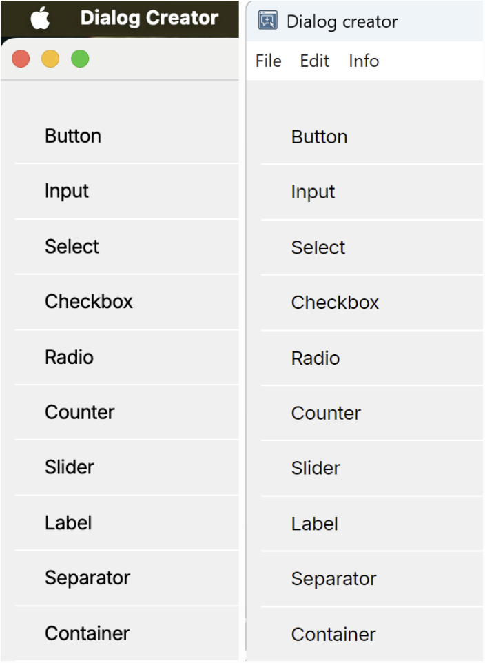
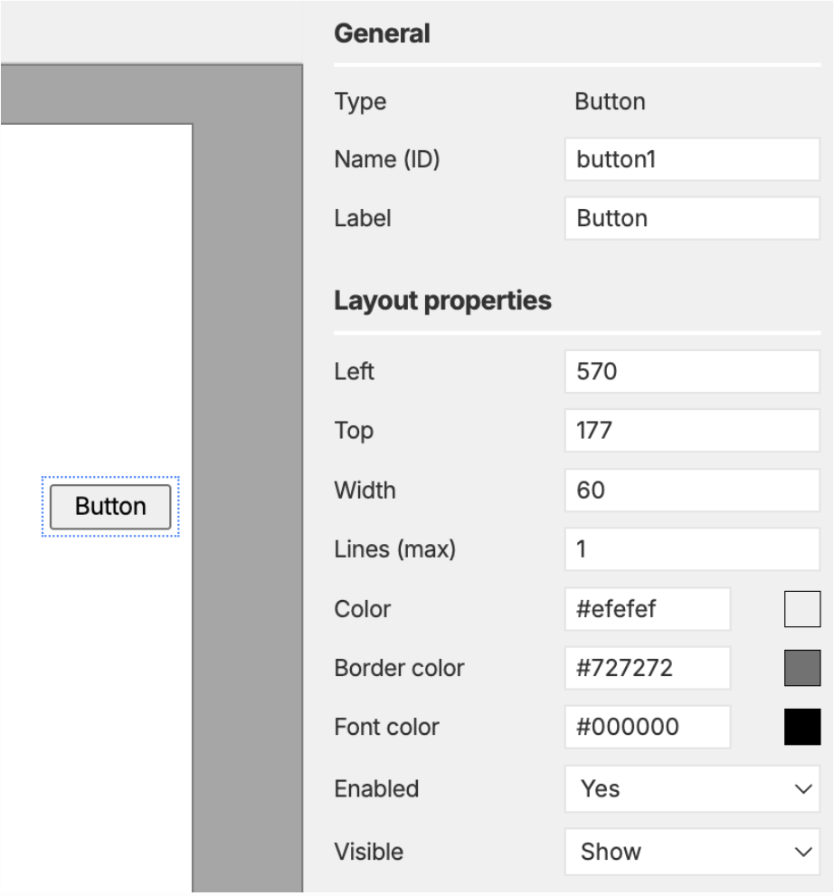
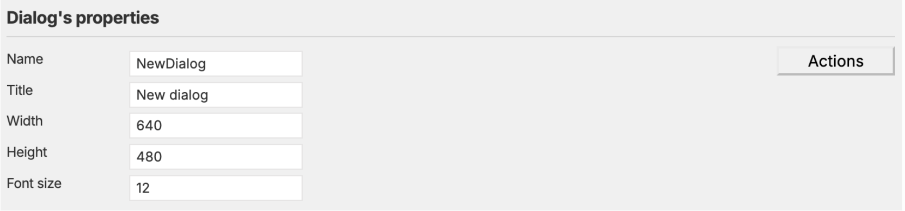

<br>

# Dialog Creator - User Manual

This document describes how to use the Dialog Creator editor window to design dialogs by adding and arranging UI elements on a canvas.

## Description
The Dialog Creator is a cross-platform, graphical interface for building dialog layouts by placing various UI elements onto a canvas. It allows users to visually design dialogs by adding, positioning, and configuring elements such as buttons, inputs, labels, checkboxes, and more.

It also allows connecting UI elements, then test custom logic instantly in a live preview.

Upon installing and opening the application, the following main window can be seen.


## Overview of the interface


This is a fresh instance of the editor window, which can be divided into five main areas.


### Elements panel (left)



The image above shows the Elements panel with available UI controls, in both MacOS and Windows styles.

This panel is the catalog of building blocks. It lists all available element types you can add to a dialog—buttons, labels, inputs, checkboxes, radios, selects, containers, separators, counters, sliders, and more. Items can be clicked to insert a new instance onto the canvas with sensible default properties. Those defaults can be changed for future inserts (for example, your preferred border of font color for certain element), using the "Default values" button to open a small window where you can set per‑type defaults.

Those new defaults are saved with the application and persist across sessions.


### Editor toolbar (top of center)


Z-order (stacking) actions for the current selection:
  - Send to back
  - Send backward
  - Bring forward
  - Bring to front

Grouping actions:
  - Group selected (enabled when 2+ elements are selected)
  - Ungroup (enabled when a persistent group is selected)

Alignment (arranging) actions — align elements relative to the first selected (anchor):
  - Align left, right, top, bottom
  - Align horizontal center (center), align vertical center (middle)
  - When aligning multiple targets at once, their relative spacing is preserved (treated as a block) and the block is aligned to the anchor.
  - Requires at least two selected elements. Use Shift+click or a lasso selection to select multiple.

Delete:
  - Remove the current selection (single element, multiple elements, or an entire group)
  - Also available via Delete/Backspace


All toolbar buttons enable or disable automatically based on what's selected. Selecting elements (to decide for grouping, alignment, or deletion) can be done in two ways: either shift-clicking on each element or using a lasso selection, as per the image above.

### Dialog canvas (center)

This is the main stage where you lay out the dialog. Newly added elements appear here as movable blocks and show a dotted outline when selected. Clicking an element once will select it and reveal its properties on the right, while clicking on empty space will clear the selection.


Elements can be dragged to reposition them, and their movement is constrained within the canvas with a small padding so items don't slip outside the visible area. Multiple elements can be selected with Shift‑click or by drawing a lasso on empty canvas, as per the image above.

These elements can then be moved together or aligned from the toolbar. Right‑clicking an element / group reveals quick actions like Duplicate, Group, or Ungroup.


### Properties panel (right)



This panel displays properties for the selected element, in the image above showing a button's properties. Different elements have different sets of properties, so only properties relevant to the selected element type are shown and enabled.

All elements have Left and Top properties to control their position on the canvas. Other properties depend on the element type, such as Label and Color for buttons, Value for inputs and labels, Options for selects, Checked for checkboxes, and so on.


Colors can either be typed as hex codes (e.g., `#FF0000` for red) or selected via a color picker that opens when clicking the color swatch, as in the image above. The color picker dissapears when clicking elsewhere on the dialog, or pressing the ESC key.

Some properties can be overwritten with custom JavaScript code in the Actions window, for example Enable or Visible, using a pre-defined set of API commands, see the details in the [custom Javascript code](#custom_js_code).


### Dialog properties and Actions (bottom)

The whole dialog has properties of its own, for instance width and height to establish how large it should be, or a name (to be referred to from other dialogs) or a title (shown in the dialog's title bar).

It also has a global font size that affects all elements uniformly, all of which are saved with the dialog and reflected in the live Preview window.

There is also an Actions button to open the code window for adding custom JavaScript logic for dialog behavior. It can be used to define how the elements interact with each other based on user input: showing/hiding/enabling controls, and updating values programmatically.




## Description of Elements

### Button
The Button element represents a clickable button. It can be styled and configured with different actions to perform when clicked.

### Input
The Input element allows users to enter text or data. It can be configured with various properties such as placeholder text, default value, and validation rules.

### Select (Dropdown)
The Select element provides a dropdown menu for users to choose from a list of options. It can be configured with default selections and multiple selection capabilities.

### Checkbox
The Checkbox element allows users to make binary choices (checked or unchecked), generally as a true / false switch when writing the options in the command syntax.

### Radio Button
The Radio Button element allows users to select one option from a set of mutually exclusive choices. Radio buttons can be grouped together to form a selection group.

### Counter
The Counter element allows users to increment or decrement a numeric value within a specified range. It can be configured with minimum and maximum limits, plus a start value.

### Slider
The Slider element provides a graphical interface for selecting a value from a continuous range. It can be customized with different step sizes and value ranges.

### Label
The Label element displays static text or information. It can be customized with different font colors, and its size depends on the text content, up to a certain maximum width.
If the text exceeds the maximum width, it will be truncated with an ellipsis (`...`). You can control how many lines of text are shown before truncation using the Line Clamp property.

### Separator
The Separator element is a visual divider used to separate different sections or groups of elements within the dialog.

### Container
The Container element is a versatile component that can hold multiple items or rows. It supports single or multi-selection modes and can be populated dynamically via the API.
The items in a Container can be selected by clicking, and multi-selection is supported via Shift+click for range selection. Their type can be restricted (e.g., numeric, character, date) so that only items of that type are selectable.

When a Container is selected, the Properties panel exposes an **Item type** dropdown alongside the selection mode. It defaults to **Any**, which allows all rows to remain interactive. Choose a specific type (Numeric, Calibrated, Binary, Character, Factor, or Date) to enforce that only rows whose metadata matches the selected type stay selectable. Rows with a different type are visually muted, ignore clicks, and are removed from the active selection.

Programmatic population supports type metadata as well. `setValue(container, array)` accepts either plain strings or objects shaped like `{ text, type, active }`. Helpers such as `listVariables()` now return descriptors with both the label and its data type; when you pair that output with a Container whose Item type is set, mismatching rows automatically render as disabled.


## Keyboard shortcuts

Arrange (Z-order) actions:

- Cmd/Ctrl + ↑: Bring forward, moves the element one step forward in stacking order.
- Cmd/Ctrl + Shift + ↑: Bring to front, places the element above all others in the canvas.
- Cmd/Ctrl + ↓: Send backward, moves the element one step backward in stacking order.
- Cmd/Ctrl + Shift + ↓: Send to back, places the element behind all others in the canvas.

These actions are disabled when no element is selected.

Grouping:

- Cmd/Ctrl + G: Group selected
- Cmd/Ctrl + Shift + G: Ungroup selected group

Movement (nudge):

- Arrow keys: Move selected element(s) by 1px
- Shift + Arrow keys: Move selected element(s) by 10px

Global:

- Cmd/Ctrl + A: Select all elements on the canvas (Editor window)

Notes:

- Shortcuts only apply when at least one element is selected and focus is not inside a text field (unless stated otherwise).
- Cmd/Ctrl modifiers are reserved for arrange and grouping actions; nudging uses arrows without Cmd/Ctrl.
- When multiple elements are selected, nudging moves all selected elements together.


## Shortcuts cheatsheet


## Working with elements

### Add a new element

In the Elements panel (left), click the element type you want to add. It will be inserted on the dialog canvas with default properties.

### Select an element

- Click an element on the canvas to select it.
- A selected element is highlighted with a dotted outline.
- The buttons on the top toolbar are enabled when an element is selected.

### Deselect elements

- Click on an empty area of the dialog canvas to clear the selection.
- The buttons on the top toolbar become disabled.

### Move an element

- Drag an element to reposition it.
- Movement is constrained within the dialog canvas with a small margin.
- Use Arrow keys to nudge by 1px; hold Shift for 10px steps (when an element is selected and focus is not in an input).

### Remove an element

- Press Delete/Backspace (when the focus is not inside a text field) to remove the selected element, or
- Click the Remove button (Trashcan icon) in the top toolbar.

## Preview window

- Opens from the File menu (Preview) or using the keyboard shortcut (Cmd/Ctrl + P)
- It renders the dialog with live interactions.
- Disabled elements remain fully visible, only greyed out (no opacity fade). Native inputs/selects retain the exact same size when disabled.
- Pressing ESC closes the Preview window.

Item selections in Preview

- Containers support multi-selection. Clicking a row toggles its selection (active state). A `'change'` event is dispatched on the Container so your handlers can react.
- Select elements are single-choice. Changing the selection dispatches `'change'` like native selects.

Runtime errors in Preview

- When Custom JS misuses the API (e.g., unsupported event, unknown element, invalid select option), a visible error box appears inside the Preview canvas. This helps spot issues without checking the console.
- The error box can be dismissed with ESC.


<a id="custom_js_code"></a>
## Custom JS code — quick start


Some dialogs have complex behaviors that require custom JavaScript code. Open the code window with the Actions button at the bottom of the Editor. This code runs at the top level automatically, with a dedicated, provided API.

Elements can be referred to by their Name (ID) either quoted or not. For example, `getValue(input1)` is the same as `getValue('input1')`.

Notes on missing elements and strict operations:

- For simple getters/setters (getValue/setValue), if a name is not found, reads return `null` (or a safe default) and writes are ignored.
- For event-related or selection operations (on, select), using an unknown element will throw a SyntaxError and show the error overlay in Preview.

Common patterns you can copy/paste:

1. Show the input's value in a label on change

```javascript
onChange(input1, () => {
  const value = "input1: " + getValue(input1);
  setValue(statusLabel, value);
});
```

2. Show or hide a label when a checkbox is toggled

```javascript
onClick(checkbox1, () => show(label1, isChecked(checkbox1)) );
```

Which is equivalent to:

```javascript
onClick(checkbox1, () => {
  if (isChecked(checkbox1)) {
    show(label1);
  } else {
    hide(label1);
  }
});
```

3. Show a select value in a label

```javascript
onChange(countrySelect, () => {
  setValue(statusLabel, "Country: " + getValue(countrySelect));
});
```

4. Update text programmatically

```javascript
setValue(statusLabel, "Ready");
```

Events:

- Buttons and custom checkboxes/radios usually use `'click'`.
- Text inputs can use `'change'` (on blur) or `'input'` (as you type).
- Selects use `'change'`.
- Tip: Prefer the helpers `onClick`, `onChange`, `onInput` for readability.
- Radio groups: pass the group name to `onChange(groupName, handler)` to attach a handler to every radio in that group. Similar to element names, if the group name is a valid identifier (e.g. `radiogroup1`), the quotes may be omitted.

Programmatic events:

- Convenience functions: `triggerChange(name)` and `triggerClick(name)` are shortcuts for triggering 'change' and 'click' events respectively.

Initialization

- Your top-level custom code runs after the Preview is ready (elements rendered and listeners attached). You can directly register handlers and set initial state without extra lifecycle wrappers.
- Event helpers:
  - `onClick(name, fn)`
  - `onChange(name, fn)`
  - `onInput(name, fn)`


```javascript
onClick(button1, () => {
  // do something
});
```

### Scripting API — reference

`showMessage(message, detail?, type?)`

- Shows an application message dialog via the host app.
- message is the visible header; detail is the body text; type (optional) controls icon: 'info' | 'warning' | 'error' | 'question'.
- Examples:
- `showMessage('Hello')`
- `showMessage('Low disk space', 'Please free up 1GB', 'warning')`
- `showMessage('Save failed', err, 'error')`

`getValue(name)`

- Get the element's value/text.
- Input/Label/Select/Counter return their current value; Checkbox/Radio return their current boolean state.
- Returns `null` if the element doesn't exist.

`setValue(name, value)`

- Set the value/text.
- Input/Label: set string; Counter: set number within its min/max; Select: set selected option by value; Checkbox/Radio: set boolean state.
- No-op if the element doesn't exist. Does not dispatch events automatically.

`isChecked(name)`

- For Checkbox/Radio, returns the live checked/selected state as a boolean.

`check(name)` / `uncheck(name)`

- Convenience methods for Checkbox and Radio elements to set on/off.
- For Radio, `check(name)` also unselects other radios in the same group.
- These do not dispatch events by themselves; if you want handlers to run, use `triggerChange()` or `triggerClick()`.

`getSelected(name)`

- Read the current selection(s) as an array of values.
- For Select, returns a single-item array (or empty array if nothing selected).
- For Container, returns labels of all selected rows.

`isVisible(name)`: boolean

  - Returns whether the element is currently visible (display not set to 'none').

`isHidden(name)`: boolean

  - Logical complement of `isVisible(name)`.

`isEnabled(name)`: boolean

  - Returns whether the element is currently enabled (not marked as disabled).

`isDisabled(name)`: boolean

  - Logical complement of `isEnabled(name)`.

`show(name, on = true)`

  - Show or hide by boolean. Use `show(name, true)` to show; `show(name, false)` to hide.

`hide(name, on = true)`

  - Convenience inverse of show: `hide(name)` hides, `hide(name, false)` shows. Internally calls `show(name, !on)`.

`enable(name, on = true)`

  - Enable or disable by boolean. Use `enable(name, true)` to enable; `enable(name, false)` to disable.

`disable(name, on = true)`

  - Convenience inverse of enable: `disable(name)` disables, `disable(name, false)` enables. Internally calls `enable(name, !on)`.

`onClick(name, handler)`

  - Shortcut for `on(name, 'click', handler)`.

`onChange(name, handler)`

  - Shortcut for `on(name, 'change', handler)`.

`onInput(name, handler)`

  - Shortcut for `on(name, 'input', handler)`.

`setSelected(name, value)`

  - Programmatically set selection.
  - For Select elements: sets the selected option by value (single-choice).
  - For Container elements: accepts a string or array of strings and replaces the current selection with exactly those labels.
  - Does not dispatch a `change` event automatically. If you need handlers to run, call `triggerChange(name)` after changing selection.
  - Throws a SyntaxError if the element doesn't exist, the control is missing, the option/row is not found, or the element type doesn't support selection.

`clearContent(element)`

  - Clears the content/value of supported elements.
  - Supported: Input (clears the text), Container (removes all rows).
  - Throws an error if used on unsupported types.

`setLabel(name, label)`

  - Set the visible label text of a Button element.
  - Throws a SyntaxError if the element doesn't exist or isn't a Button.

`changeValue(name, oldValue, newValue)`

  - Rename a specific item within a Container from `oldValue` to `newValue`.
  - If the item is currently selected, the container's selection mirror is updated accordingly.
  - No event is dispatched automatically; call `triggerChange(name)` if you want change handlers to run.
  - Throws a SyntaxError if the element doesn't exist or isn't a Container.

`updateSyntax(command)`

  - Updates the Syntax Panel with the provided command string. The panel remains open alongside the Preview window and mirrors its width; closing either window also closes the other.
  - Content is rendered with preserved whitespace/line breaks in a monospace font.
  - If the floating Syntax Panel cannot be created, a fallback inline panel appears immediately below the Preview canvas inside the Preview window.
  - Example:

```javascript
const sel = getSelected(radiogroup1);
const cmd = construct_command(sel);
updateSyntax(cmd);
```

`run(command)`

  - Legacy no-op retained for backward compatibility. Use `updateSyntax(command)` to show commands.


Validation and highlight helpers

`addError(name, message)`

  - Show a tooltip-like validation message attached to the element and apply a visual highlight (glow). Multiple distinct messages on the same element are de-duplicated and the first one is shown. The highlight is removed automatically when all messages are cleared.

`clearError(name, message?)`

  - Clear a previously added validation message. If `message` is provided, only that message is removed; otherwise, all messages for the element are cleared.

Element-specific notes and examples

- Input

  - Read: `getValue(myInput)`: returns a string
  - Write: `setValue(myInput, 'hello')`
  - Events: 'change' (on blur) or 'input' (as you type)

- Label

  - Read: `getValue(myLabel)`: returns a string
  - Write: `setValue(myLabel, 'New text')`

- Select

  - Read: `getValue(mySelect)`: returns a string
  - Write: `setValue(mySelect, 'RO')`
  - Event: 'change'

- Checkbox

  - Read state: `isChecked(myCheckbox)`: returns a boolean
  - Write state: `check(myCheckbox)` and `uncheck(myCheckbox)`
  - Event: 'click'

- Radio

  - Read state: `isChecked(myRadio)`: returns a boolean
  - Write state: `check(myRadio)` and `uncheck(myRadio)`
  - Event: 'click'

- Counter

  - Set value within its min/max: `setValue(myCounter, 7)`
  - Read current number: `getValue(myCounter)`

- Button

  - Pressed feedback is built-in in Preview; your handler can trigger other UI changes.
  - Event: 'click'

- Slider
  - Dragging is supported in Preview, and sliders react to changes.


Practical patterns

- Conditional show a panel when a checkbox is checked:

```javascript
onClick(myCheckbox, () => {
  show(myPanel, isChecked(myCheckbox));
  // or: hide(myPanel, isUnchecked(myCheckbox))
});
```

- Mirror an input's text to a label on change:

```javascript
onChange(myInput, () => setValue(myLabel, getValue(myInput)) );
```

- Select a value in a Select (no auto-dispatch), then notify listeners:

```javascript
setSelected(countrySelect, "RO");
triggerChange(countrySelect);
```

- Conditional enable/disable situations:

```javascript
onClick(lockCheckbox, () => {
  disable(saveBtn, isChecked(lockCheckbox)); // disable when locked
  // Equivalent forms:
  // enable(saveBtn, isUnchecked(lockCheckbox));

  // Unconditional forms:
  // enable(saveBtn);             // just enable
  // disable(saveBtn);            // just disable
});
```

- Replace a Container's selection (multi-select) and notify listeners:

```javascript
setSelected(variablesContainer, ["Sepal.Width"]);
triggerChange(variablesContainer);
```

- Add or remove items in a Container:

```javascript
addValue(variablesContainer, "Sepal.Length");
clearValue(variablesContainer, "Sepal.Width");
```

- Update a Button label and rename a Container item:

```javascript
setLabel(runBtn, "Run Analysis");
changeValue(variablesContainer, "Sepal.Length", "Sepal Len");
```

Notes

- Programmatic state changes (e.g., `check`, `setValue`) do not automatically dispatch events. Use `triggerChange()` or `triggerClick()` when you need the dialog to behave as if the user had interacted with the element.
- The selection command (`setSelected`) also does not auto-dispatch, but it can be paired with `triggerChange(name)` if you rely on change triggers.
- Validation helpers (`addError`, `clearError`) are purely visual aids in Preview; they do not block execution or change element values.

### Populate container contents

Containers can show rows populated via API. For example:

```javascript

setValue(container1, listDatasets());

onChange(container1, () => setValue(
  container2,
  listVariables(getSelected(container1))
));
```

`listVariables()` returns objects with both the variable label and its data type, so passing its output straight into `setValue` preserves the metadata required for type filtering.

- `setValue(container, array)` accepts an array of strings or objects shaped like `{ text, type, active }` and renders each entry as a row.
- Rows automatically adopt the container's `fontColor`, `activeBackgroundColor`, and `activeFontColor`.
- If the container's Item type is restricted, rows whose `type` metadata does not match are rendered disabled and cannot be selected.
- Containers scroll automatically when the row list exceeds the container height.

Multi-selection containers support range selection: click an item, then Shift-click another to select or deselect the entire range. Single containers toggle a single active row.

## Commands

- Command construction lives entirely in the Actions (Code) window via custom JS.

## File menu actions

- New: Optionally saves current work, then clears the canvas.
- Load dialog: Load a dialog JSON file into the editor.
- Save dialog: Export the current dialog to JSON.
- Preview: Open the live preview window.

## Multi-selection and grouping

### Select multiple elements

- Shift + Click to add or remove elements from the current selection.
- Lasso selection: Click and drag on an empty area of the dialog canvas to draw a selection rectangle. All elements overlapping the rectangle are selected.
  - Hold Shift while lassoing to add to the existing selection instead of replacing it.

### Move multiple elements together (ephemeral selection)

- When two or more elements are selected (but not grouped), dragging any selected element will move all selected elements together.
- Arrow key nudging also moves all selected elements together.
- In the Properties panel, the Type field shows "Multiple selection" and only Left and Top are editable; changing these moves the whole selection.

### Group selection (persistent group)

- To lock a multi-selection into a single movable unit, click the Group button in the toolbar or press Cmd/Ctrl + G.
- A group container is created around the selected elements. Selecting a child of a group selects the whole group.
- Groups can be moved and nudged like individual elements.

### Ungroup

- Select the group container and click Ungroup in the toolbar or press Cmd/Ctrl + Shift + G to return the elements to the top level. The former members remain selected.


## Tips & notes

- Right-click an element or group to access quick actions like Duplicate, Group, or Ungroup.
- Press Enter while editing a property field to commit changes (the editor will blur the field to trigger the update).
- Some numeric fields are constrained (e.g., size within the canvas, line clamp limited to a small maximum). If a value is out of range, the editor will adjust it automatically.
- Element Name (ID) must be unique. If a duplicate is entered, it will be rejected and an error shown.
- Visibility (isVisible) and Enabled (isEnabled) toggles affect how elements render and behave in the editor.


## Troubleshooting

- Arrange buttons are disabled
  - Ensure an element is selected. Click an element on the canvas.

- Delete key doesn't remove the element
  - Make sure focus isn't inside a text field. Click on the canvas and try again.

- Property change seems ignored
  - Most properties apply on blur (when the input loses focus). Press Enter or click elsewhere to commit.
