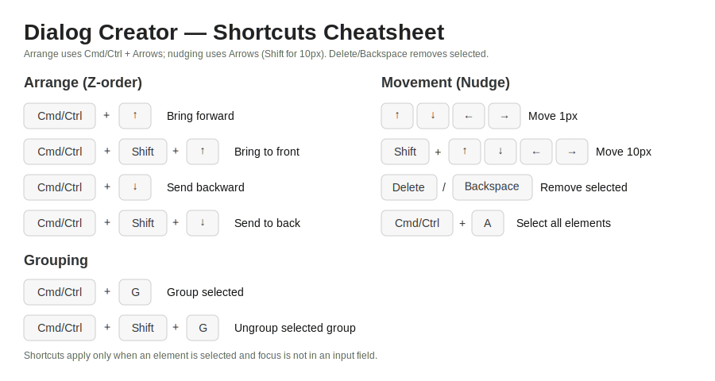

# Dialog Creator — User Manual

This document describes how to use the Dialog Creator editor window to design dialogs by adding and arranging UI elements on a canvas.

- Platform: Desktop (Electron)
- Primary file: `src/pages/editor.html`

## Overview of the interface

The editor window is divided into four main areas:

1. Elements panel (left)
   - Shows the list of available element types.
   - Click any item to add a new element instance to the dialog canvas.
   - A "Default values" button opens a window where default properties per element type can be managed.

2. Editor toolbar (top of center)
   - Provides arrange (Z-order) actions for the currently selected element:
     - Send to back
     - Send backward
     - Bring forward
     - Bring to front
   - Grouping actions:
     - Group selected (enabled when 2+ elements are selected)
     - Ungroup (enabled when a group is selected)
   - Buttons enable/disable contextually depending on the current selection.

3. Dialog canvas (center)
   - The working area where elements are placed and arranged.
   - Click an element to select it. Click the empty canvas to clear the selection.
   - Drag a selected element to reposition it. Movement is constrained within the canvas with a small padding.

4. Properties panel (right)
   - Displays properties for the selected element.
   - Only properties relevant to the selected element type are shown and enabled.
   - Includes an Actions section with a Conditions button and a Remove button.

## Keyboard shortcuts

Arrange (Z-order):
- Cmd/Ctrl + ↑: Bring forward
- Cmd/Ctrl + Shift + ↑: Bring to front
- Cmd/Ctrl + ↓: Send backward
- Cmd/Ctrl + Shift + ↓: Send to back

Grouping:
- Cmd/Ctrl + G: Group selected
- Cmd/Ctrl + Shift + G: Ungroup selected group

Movement (nudge):
- Arrow keys: Move selected element(s) by 1px
- Shift + Arrow keys: Move selected element(s) by 10px

Global:
- Cmd/Ctrl + A: Select all elements on the canvas (Editor window)
  - In the Conditions window, Cmd/Ctrl + A selects only the condition rules textarea.

Notes:
- Shortcuts only apply when at least one element is selected and focus is not inside a text field (unless stated otherwise).
- Cmd/Ctrl modifiers are reserved for arrange and grouping actions; nudging uses arrows without Cmd/Ctrl.
- When multiple elements are selected, nudging moves all selected elements together.

### Shortcuts cheatsheet



## Working with elements

### Add a new element
- In the Elements panel (left), click the element type you want to add. It will be inserted on the dialog canvas with default properties.

### Select an element
- Click an element on the canvas to select it.
- A selected element is highlighted with a dotted outline.
- The arrange toolbar buttons enable when an element is selected.

### Deselect elements
- Click on an empty area of the dialog canvas to clear the selection.
- The arrange toolbar buttons and the Remove button become disabled.

### Move an element
- Click and drag an element to reposition it.
- Movement is constrained within the dialog canvas with a small margin.
- Use Arrow keys to nudge by 1px; hold Shift for 10px steps (when an element is selected and focus is not in an input).
- The cursor changes to indicate dragging.

### Remove an element
- Press Delete/Backspace (when the focus is not inside a text field) to remove the selected element, or
- Click the Remove button in the Actions section of the Properties panel.

## Preview window
- Opens from the File menu (Preview) and renders the dialog with live interactions.
- Disabled elements remain fully visible, only greyed out (no opacity fade). Native inputs/selects retain the exact same size when disabled.
- ESC closes popovers (like color pickers). If a runtime error overlay is visible, ESC dismisses it first; pressing ESC again closes the Preview window.

Selections in Preview
- Containers support multi-selection. Clicking a row toggles its selection (active state). A `'change'` event is dispatched on the Container so your handlers can react.
- Select elements are single-choice. Changing the selection dispatches `'change'` like native selects.

Runtime errors in Preview
- When Custom JS misuses the API (e.g., unsupported event, unknown element, invalid select option), a visible error box appears inside the Preview canvas. This helps spot issues without checking the console.
- You can dismiss the error box with ESC. The same error is also logged to the Editor console.

### Custom JS code — quick start

Some dialogs have complex behaviors that require custom JavaScript code. The editor provides a code window for writing and testing such code. This code runs at the top level automatically, with a dedicated, provided `ui` API.

Elements can be referred to by their Name (ID) either quoted or not. For example, `getValue(input1)` is the same as `getValue('input1')`.

Notes on missing elements and strict operations:
- For simple getters/setters (getValue/setValue), if a name is not found, reads return `null` (or a safe default) and writes are ignored.
- For event-related or selection operations (on, trigger, select), using an unknown element will throw a SyntaxError and show the error overlay in Preview.

Common patterns you can copy/paste:

1) Show the input's value in a label on change

```javascript
onChange(input1, () => {
  setValue(statusLabel, 'input1: ' + getValue(input1));
});
```

2) Show or hide a label when a checkbox is toggled

```javascript
onClick(checkbox1, () => {
  show(label1, isChecked(checkbox1));
});
```

Which is equivalent to:

```javascript
onClick(checkbox1, () => {
  if (isChecked(checkbox1)) {
    show(label1);
  } else {
    hide(label1);
  }
});
```

Note that this type of logic can also be done with Conditions (no code needed), for example the Conditions for the element label1 could be:

```
show if checkbox1 == checked;
hide if checkbox1 != checked;
```

Whenever the Conditions and the Custom JS code conflict, the Custom JS code takes precedence.

3) Show a select value in a label
```javascript
onChange(countrySelect, () => {
  setValue(statusLabel, 'Country: ' + getValue(countrySelect));
});
```

4) Update text programmatically
```javascript
setValue(statusLabel, 'Ready');
```

Events:
  - Buttons and custom checkboxes/radios usually use `'click'`.
  - Text inputs can use `'change'` (on blur) or `'input'` (as you type).
  - Selects use `'change'`.
  - Tip: Prefer the helpers `onClick`, `onChange`, `onInput` for readability.
  - Note: The generic `on(name, event, handler)` is available as `ui.on(...)` (it's not part of the shorthand prelude).

Programmatic events:
  - User events can be indicated, for instance with `trigger(name, 'change')`. Only the following events are supported by the API: `click`, `change`, `input`. Using other event names throws a SyntaxError and shows the error overlay in Preview.
    - `click` on a Checkbox/Radio behaves like a real click: it toggles the control and re-evaluates conditions.
    - `change` dispatches the event to inputs/selects without modifying the current value by itself.


Initialization
- Your top-level custom code runs after the Preview is ready (elements rendered, listeners attached, and Conditions evaluated). You can directly register handlers and set initial state without extra lifecycle wrappers.
- Event helpers:
  - `onClick(name, fn)` — same as `on(name, 'click', fn)`
  - `onChange(name, fn)` — same as `on(name, 'change', fn)`
  - `onInput(name, fn)` — same as `on(name, 'input', fn)`

### Scripting API — reference

Note: You can use all helpers without the `ui.` prefix (recommended for brevity). The `ui.*` form also works (e.g., `ui.onClick`, `ui.show`).

`showMessage(message, detail?, type?)`
  - Shows an application message dialog via the host app.
  - message is the visible header; detail is the body text; type (optional) controls icon: 'info' | 'warning' | 'error' | 'question'.
  - Examples:
  - `showMessage('Hello')`
  - `showMessage('Low disk space', 'Please free up 1GB', 'warning')`
  - `showMessage('Save failed', String(err), 'error')`

`getValue(name)`
  - Get the element's value/text.
  - Input/Label/Select/Counter return their current value; Checkbox/Radio return their current boolean state.
  - Returns `null` if the element doesn't exist.

`setValue(name, value)`
  - Set the value/text.
  - Input/Label: set string; Counter: set number within its min/max; Select: set selected option by value; Checkbox/Radio: set boolean state.
  - No-op if the element doesn't exist. Does not dispatch events automatically.

`isChecked(name)`
  - For Checkbox/Radio, returns the live checked/selected state as a boolean.

`check(name)` / `uncheck(name)`
  - Convenience methods for Checkbox and Radio elements to set on/off.
  - For Radio, `check(name)` also unselects other radios in the same group.
  - These do not dispatch events by themselves; if you want handlers to run, use `trigger(...)`.

`getSelected(name)`
  - Read the current selection(s) as an array of values.
  - For Select, returns a single-item array (or empty array if nothing selected).
  - For Container, returns labels of all selected rows.

- `isVisible(name)`: boolean
  - Returns whether the element is currently visible (display not set to 'none').

`isVisible(name)`: boolean
  - Returns whether the element is currently enabled (not marked as disabled).

`isHidden(name)`: boolean
  - Logical complement of `isVisible(name)`.

`isEnabled(name)`: boolean
  - Shows the element by toggling its display. Hidden elements are not interactive.

`isDisabled(name)`: boolean
  - Logical complement of `isEnabled(name)`.

- `hide(name)`
  - Hides the element, similar to `show(name, false)`.

- `enable(name)` / `enable(name, on = true)`
  - Enables the element. Disabled elements remain visible but are non-interactive.

- `disable(name)`
  - Disables the element, similar to `enable(name, false)`.

- `onClick(name, handler)`
  - Shortcut for `on(name, 'click', handler)`.

- `onChange(name, handler)`
  - Shortcut for `on(name, 'change', handler)`.

- `onInput(name, handler)`
  - Shortcut for `on(name, 'input', handler)`.

- `trigger(name, event)`
  - Dispatch a synthetic event on the element without directly changing its state.
  - Supported events: `'click'`, `'change'`, `'input'`.
  - Notes:
    - For Checkbox/Radio, triggering `'click'` behaves like a user click (the control toggles via its built-in logic and conditions are re-evaluated).
    - Triggering `'change'` on inputs/selects notifies listeners but does not change the current value by itself.

- `setSelected(name, value)`
  - Programmatically set selection.
  - For Select elements: sets the selected option by value (single-choice).
  - For Container elements: accepts a string or array of strings and replaces the current selection with exactly those labels.
  - Does not dispatch a `change` event automatically. If you need handlers to run, call `trigger(name, 'change')` after changing selection.
  - Throws a SyntaxError if the element doesn't exist, the control is missing, the option/row is not found, or the element type doesn't support selection.


Element-specific notes and examples
- Input
  - Read: `getValue(myInput)`: returns a string
  - Write: `setValue(myInput, 'hello')`
  - Events: 'change' (on blur) or 'input' (as you type)

- Label
  - Read: `getValue(myLabel)`: returns a string
  - Write: `setValue(myLabel, 'New text')`

- Select
  - Read: `getValue(mySelect)`: returns a string
  - Write: `setValue(mySelect, 'RO')`
  - Event: 'change'

- Checkbox
  - Read state: `isChecked(myCheckbox)`: returns a boolean
  - Write state: `check(myCheckbox)` and `uncheck(myCheckbox)`
  - Event: 'click'

- Radio
  - Read state: `isChecked(myRadio)`: returns a boolean
  - Write state: `check(myRadio)` and `uncheck(myRadio)`
  - Event: 'click'

- Counter
  - Set value within its min/max: `setValue(myCounter, 7)`
  - Read current number: `getValue(myCounter)`

- Button
  - Pressed feedback is built-in in Preview; your handler can trigger other UI changes.
  - Event: 'click'

- Slider
  - Dragging is supported in Preview. To react to changes, listen on the wrapper or the handle's mouseup.

Practical patterns
- Show a panel when a checkbox is checked:
```javascript
onClick(myCheckbox, () => {
  show(myPanel, isChecked(myCheckbox));
});
```

- Mirror an input's text to a label on change:
```javascript
onChange(myInput, () => {
  setValue(myLabel, getValue(myInput));
});
```

- Select a value in a Select (no auto-dispatch), then notify listeners:
```javascript
setSelected(countrySelect, 'RO');
trigger(countrySelect, 'change');
```

- Replace a Container's selection (multi-select) and notify listeners:
```javascript
setSelected(variablesContainer, ['Sepal.Width']);
trigger(variablesContainer, 'change');
```

- Add or remove rows in a Container (not supported for Select):
```javascript
addValue(variablesContainer, 'Sepal.Length');
deleteValue(variablesContainer, 'Sepal.Width');
```

Notes
- Conditions and Custom JS can both control visibility/enabled state. If they conflict at runtime, the last action wins; in practice, your Custom JS will take precedence right after it runs.
- Programmatic state changes (e.g., `check`, `setValue`) do not automatically dispatch events. Use `trigger` when you need the dialog to behave as if the user had interacted with the element.
- Selection helpers (`setSelected`) also do not auto-dispatch; pair them with `trigger(name, 'change')` if you rely on change triggers.


## Syntax window
- Opens from the File menu (Syntax) or via the dedicated button when enabled.
- Shows an Elements table; clicking a row inserts a token like {name} into the textarea for building commands.
- Text persists within the session; use Save & Close to send the text back to the editor.

## File menu actions
- New: Optionally saves current work, then clears the canvas.
- Load dialog: Load a dialog JSON file into the editor.
- Save dialog: Export the current dialog to JSON.
- Preview: Open the live preview window.

## Multi-selection and grouping

### Select multiple elements
- Shift + Click to add or remove elements from the current selection.
- Lasso selection: Click and drag on an empty area of the dialog canvas to draw a selection rectangle. All elements overlapping the rectangle are selected.
  - Hold Shift while lassoing to add to the existing selection instead of replacing it.

### Move multiple elements together (ephemeral selection)
- When two or more elements are selected (but not grouped), dragging any selected element will move all selected elements together.
- Arrow key nudging also moves all selected elements together.
- In the Properties panel, the Type field shows "Multiple selection" and only Left and Top are editable; changing these moves the whole selection.

### Group selection (persistent group)
- To lock a multi-selection into a single movable unit, click the Group button in the toolbar or press Cmd/Ctrl + G.
- A group container is created around the selected elements. Selecting a child of a group selects the whole group.
- Groups can be moved and nudged like individual elements.

### Ungroup
- Select the group container and click Ungroup in the toolbar or press Cmd/Ctrl + Shift + G to return the elements to the top level. The former members remain selected.

### Conditions (per element)
- With an element selected, click Conditions in the Actions section to open the conditions window.
- Use the conditions window to define dynamic behaviors for the selected element. (Details depend on the project's conditions UI.)

## Dialog-level properties

In the "Dialog's properties" area (above the Properties panel), you can edit:
- Name
- Title
- Width
- Height
- Font size

Behavior:
- Width and Height take effect when the field loses focus (after editing it, click elsewhere or press Enter to blur).
- Font size updates the typography of supported elements across the dialog.

## Element types and key properties

Below is a summary of element types supported by the editor and their notable properties. The Properties panel only shows fields relevant to the selected element type.

- Button
  - Label (text)
  - Color
  - Width (max)
  - Lines (max) — line clamp for the label text

- Input
  - Value (text)
  - Width, Height

- Select
  - Value(s)
  - Width
  - Arrow color (dropdown indicator)
  - Data source (Custom or R workspace)

- Checkbox
  - Checked
  - Fill (when checked)
  - Color
  - Size

- Radio
  - Size
  - Color
  - Group
  - Selected

- Counter
  - Start Val, Max val
  - Space (padding between arrows and value)
  - Color (affects arrows)

- Slider
  - Width, Height
  - Direction (horizontal/vertical)
  - Handle properties: Position (%), Shape (triangle or circle), Color, Size

- Label
  - Value (text)

- Separator
  - Width, Height
  - Color

- Container
  - Width, Height
  - Object class (Dataset or Variable)

## Arrange (Z-order) actions

Use the toolbar or keyboard shortcuts to change the stacking order of the selected element:
- Send to back: places the element behind all others in the canvas.
- Send backward: moves the element one step backward in stacking order.
- Bring forward: moves the element one step forward in stacking order.
- Bring to front: places the element above all others in the canvas.

These actions are disabled when no element is selected.

## Tips & notes

- Press Enter while editing a property field to commit changes (the editor will blur the field to trigger the update).
- Some numeric fields are constrained (e.g., size within the canvas, line clamp limited to a small maximum). If a value is out of range, the editor will adjust it automatically.
- Element Name (ID) must be unique. If a duplicate is entered, it will be rejected and an error shown.
- Visibility (isVisible) and Enabled (isEnabled) toggles affect how elements render and behave in the editor.
- Grouping is an editor convenience: when exporting or previewing, groups are flattened and only individual elements (with absolute positions) are saved.

Build notes
- The Code window uses a CodeMirror bundle that's rebuilt only when its entry source changes. This keeps builds fast during development.

## Troubleshooting

- Arrange buttons are disabled
  - Ensure an element is selected. Click an element on the canvas.

- Delete key doesn't remove the element
  - Make sure focus isn't inside a text field. Click on the canvas and try again.

- Property change seems ignored
  - Most properties apply on blur (when the input loses focus). Press Enter or click elsewhere to commit.

## Appendix: Icons used in the toolbar

The toolbar uses SVG icons from `src/assets/`:
- selection-bottom-symbolic.svg — Send to back
- selection-lower-symbolic.svg — Send backward
- selection-raise-symbolic.svg — Bring forward
- selection-top-symbolic.svg — Bring to front

